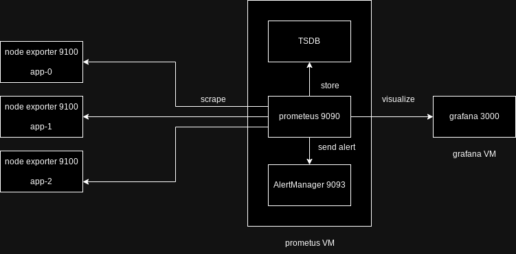

# Resource Monitoring Setup

The image above illustrates the architecture of the monitoring resources implemented in this project. It depicts the relationship between Prometheus, Grafana, AlertManager, and Node Exporter, showcasing how they work together to provide comprehensive monitoring capabilities.
## Overview
This project provides a setup for resource monitoring using Prometheus, Grafana, AlertManager, and Node Exporter. It includes Ansible roles for provisioning and configuring the monitoring stack.

## Prerequisites
Before getting started, ensure you have the following installed:
- Ansible
- Prometheus
- Grafana
- AlertManager
- Node Exporter

## Getting Started
To get started with this project, follow these steps:
1. Clone the repository: `git clone https://github.com/wussh/ansible-resource-monitoring.git`
2. Navigate to the project directory: `cd ansible-resource-monitoring`

## Usage
This project is organized into Ansible roles, each responsible for provisioning and configuring a specific component of the monitoring stack. Here's an overview of the roles:
- `prometheus`: Installs and configures Prometheus server.
- `grafana`: Installs and configures Grafana dashboard.
- `alertmanager`: Installs and configures AlertManager for alerting.
- `node-exporter`: Installs and configures Node Exporter for collecting system metrics.

To provision and configure the monitoring stack, run the following command:
```
ansible-playbook -i inventory/hosts provision/*.yaml
```